# 全部优化轨迹图

## V5

### DSA Indexer — 9.33x

### DSA Indexer Backward — 3.31x
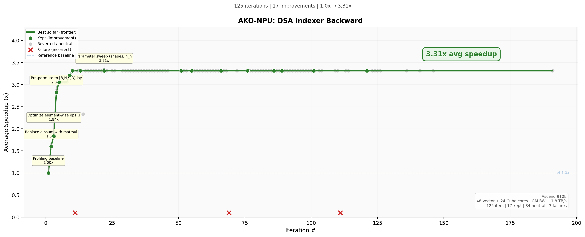

### MatMul+LeakyReLU（从 Ascend C 出发）— 6.15x

### MatMul+LeakyReLU（从 PyTorch 出发）— 4.84x
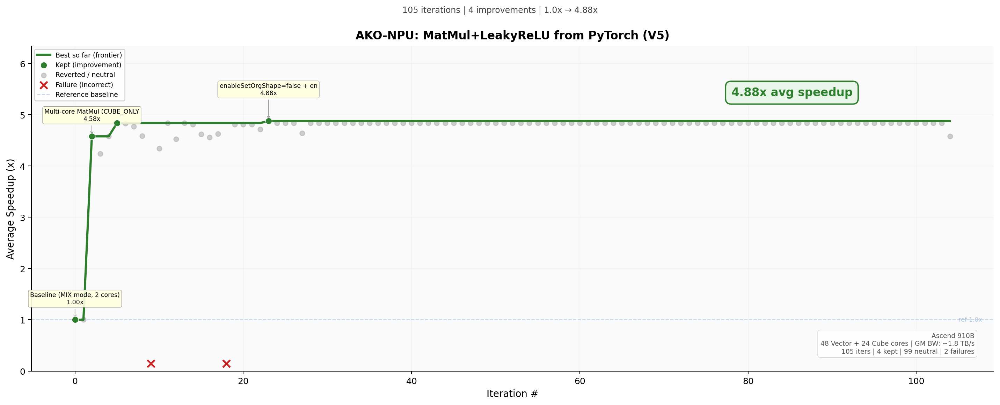

### Attention Backward（torch_npu）— 2.6-3.6x
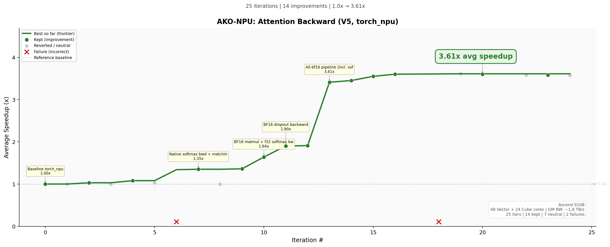

## V4

### MatMul+LeakyReLU（从 PyTorch 出发）— 24.6x
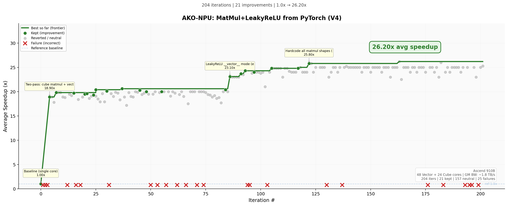

### Attention Backward — 16.4x
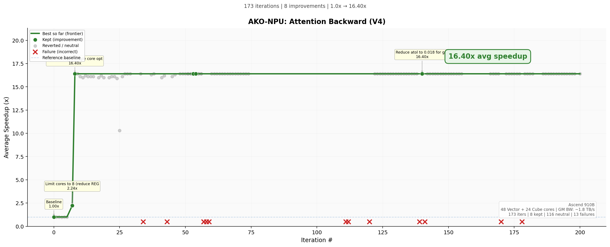

### MatMul+LeakyReLU（从 Ascend C 出发）— 3.01x
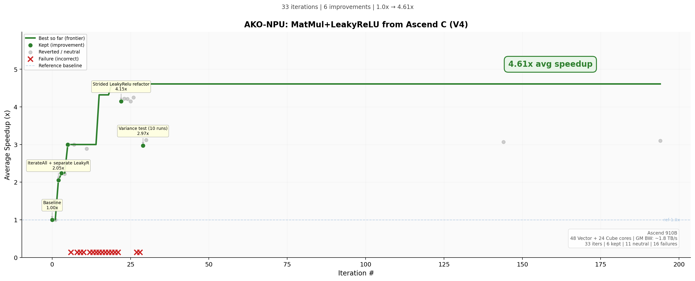

## V2

### MatMul+LeakyReLU（从 PyTorch 出发）— 9.0x
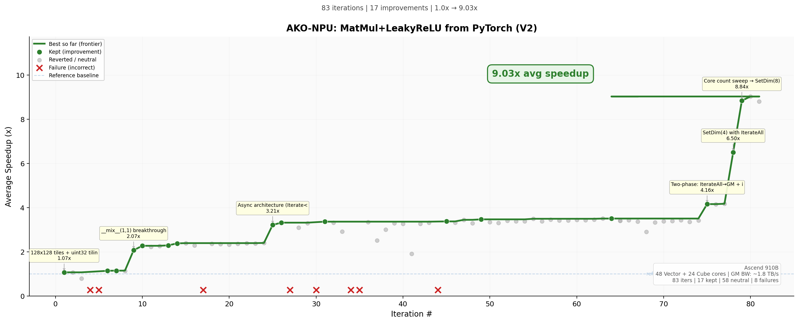

### Attention Backward — 14.7x
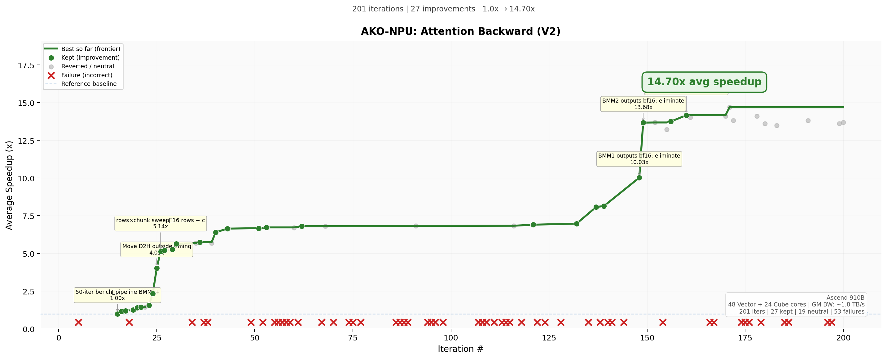

### MatMul+LeakyReLU（从 Ascend C 出发）— 2.1x
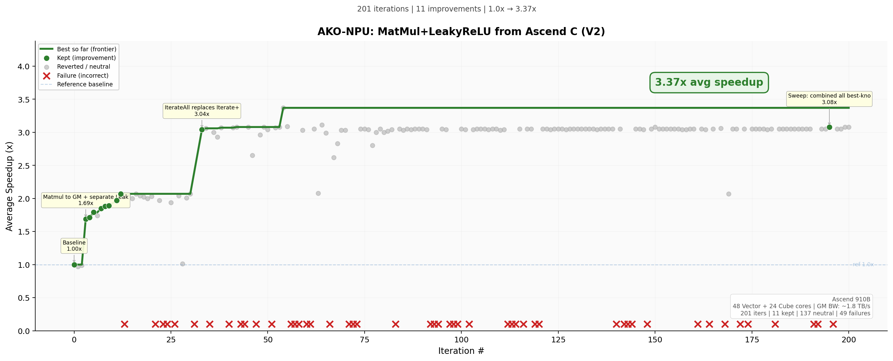

## V3

### LM Head Projection
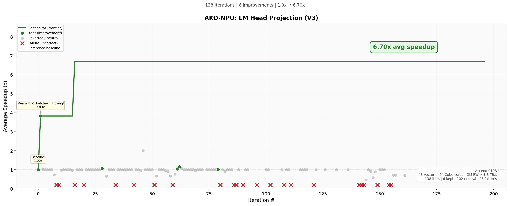

## V1

### Softmax — 1.16x
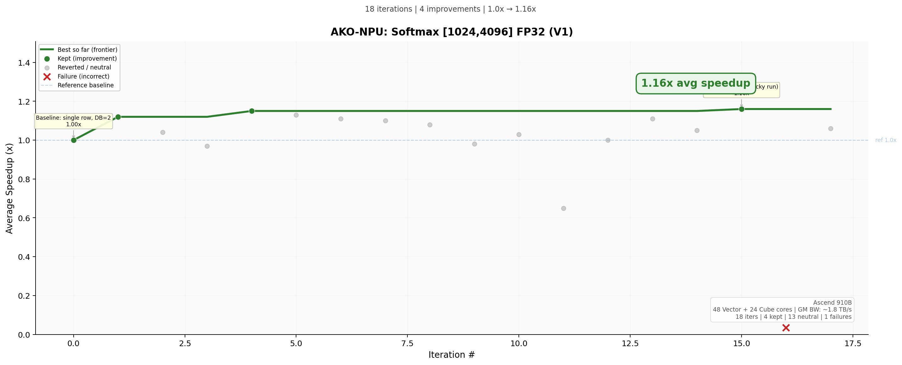
