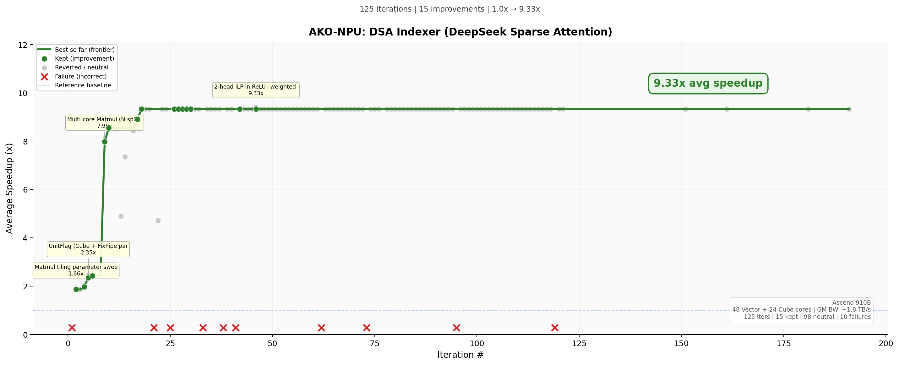
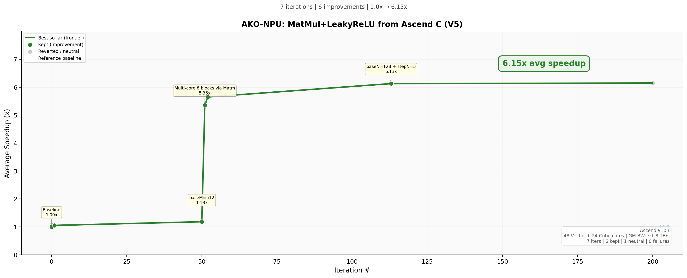

# AKO-NPU Practice

[AKO-NPU](https://dev.sankuai.com/code/repo-detail/~qinjiayu02/ako-npu) 框架的实践案例集。记录不同算子在不同框架版本下的优化轨迹、发现的问题、以及框架的迭代改进过程。

## 最新结果

> **注意：** 每个实验的 baseline 定义和计时方式可能不同（纯 kernel 时间 vs 含 host I/O、是否含平台初始化开销等），因此不同实验之间的加速比**不宜直接横向对比**。加速比仅反映各自实验内从 baseline 到最优的相对改善。

### DSA Indexer — 9.33x


### MatMul+LeakyReLU（从 Ascend C 出发）— 6.15x


更多轨迹图见 [PLOTS.md](https://dev.sankuai.com/code/repo-detail/~qinjiayu02/ako-npu-practice/file/detail?path=PLOTS.md)。

## 独立验证结果汇总

所有结果均在独立环境下二次验证（ASCEND_RT_VISIBLE_DEVICES=7 单卡隔离）。

| 版本 | 案例 | 算子 | 迭代 | Baseline | 实测最优 | 加速比 | 精度 |
|------|------|------|------|----------|---------|--------|------|
| **V5** | dsa-indexer-bwd | DSA Indexer Backward [1,4096,4096] | 200 | 180.4 ms | 54.3 ms | **3.31x** | ✅ |
| **V5** | dsa-v5 | DSA Indexer [1,1,4096] | 125 | ~40 us | 4.3 us | **9.33x** | ✅ |
| **V5** | matmul-asc-v5 | MatMul+LeakyReLU (Ascend C) | 200 | 226.09 us | 36.2 us | **6.15x** | ✅ |
| **V5** | matmul-py-v5 | MatMul+LeakyReLU (PyTorch) | 105 | 98.62 us | 20.36 us | **4.84x** | ✅ |
| **V5** | attn-bwd-v5 | Attention Backward (torch_npu) | 25 | 1.40/11.42/53.26 ms | 0.53/3.77/14.90 ms | **2.6-3.6x** | ✅ |
| **V4** | matmul-py-v4 | MatMul+LeakyReLU (PyTorch→NPU) | 204 | 408.34 us | 16.6 us | **24.6x** | ✅ |
| **V4** | attn-bwd-v4 | Attention Backward (3 shapes) | 173 | 316.5 ms | 19.3 ms | **16.4x** | ✅ |
| **V4** | matmul-asc-v4 | MatMul+LeakyReLU (Ascend C) | 33 | 224.55 us | 74.5 us | **3.01x** | ✅ |
| V3 | lm-head | LM Head [2048→102400] | 138 | W4=1126us | W4=287us | **3.9x** | ✅ |
| V3 | attn-bwd-v2 | Attention Backward | 5 | 162.8 ms | 1.1 ms | **148x**¹ | ✅ |
| V3 | vae-residual | VAE Conv+GN+SiLU Residual | 200 | ~15 ms | 27-42 us (多kernel) | **~500x**² | ⚠️ |
| V2 | matmul-py | MatMul+LeakyReLU (PyTorch) | 83 | 228 us | 24.3 us | **9.4x** | ✅ |
| V2 | attn-bwd | Attention Backward | 186 | 2.78 ms | 0.201 ms | **13.8x** | ❌ atol 超标 |
| V2 | matmul-asc | MatMul+LeakyReLU (Ascend C) | 60 | 227.9 us | 79.5 us | **2.87x** | ✅ |
| V1 | softmax | Softmax [1024,4096] | 17 | 53.41 us | 49.91 us | **1.07x** | ✅ |

¹ attn-bwd-v2 的 148x 加速主要来自 iter 3 引入 `__mix__` Cube 模式（从纯 Vector 162ms 跳到 Cube 1.7ms），本质是算法切换而非微优化。仅跑了 5 轮。

² vae-residual 拆成了多个子 kernel，精度验证有异常值（max_rel_error=2084），需注意。

## 框架版本

| 版本 | 核心改动 | 案例 |
|------|---------|------|
| **V1** | 初始验证（子 agent，skills 手动读） | add、softmax |
| **V2** | 独立进程 + CANNBot 集成 | matmul-asc、matmul-py、attn-bwd |
| **V3** | 规则持久化（CLAUDE.md）+ 迭代规范 | attn-bwd-v2、vae-residual、lm-head |
| **V4** | 精度硬约束（失败必须 revert） | matmul-asc-v4、matmul-py-v4、attn-bwd-v4 |
| **V5** | References 字段引导 skill 查阅 | dsa-v5、matmul-asc-v5、matmul-py-v5、attn-bwd-v5 |

详细版本演进、问题分析和历史版本轨迹图见 [REPORT.md](https://dev.sankuai.com/code/repo-detail/~qinjiayu02/ako-npu-practice/file/detail?path=REPORT.md)。

## 项目结构

```
AKO-NPU-practice/
├── README.md           # 本文件（最新结果 + 汇总表）
├── REPORT.md           # 详细版本演进 + 问题分析
├── PLOTS.md            # 全部优化轨迹图
├── plots/              # 轨迹图文件
├── data/               # 标准化 CSV 数据
├── scripts/            # extract_csv.py + plot_trajectory.py
└── cases/
    ├── COPY_RULES.md                # 复制规则说明
    ├── AKO-NPU-run-dsa-indexer-bwd/ # V5: DSA Indexer Backward (3.31x)
    ├── AKO-NPU-run-mamba-ssd/      # V5: Mamba-2 SSD（运行中）
    ├── AKO-NPU-run-causal-attn/    # V5: MinGPT Causal Attention（运行中）
    ├── AKO-NPU-run-rope/           # V5: RoPE 旋转位置编码（运行中）
    ├── AKO-NPU-run-fused-add-rmsnorm/ # V5: Fused Add+RMSNorm（运行中）
    ├── AKO-NPU-run-minigpt-block/  # V5: MiniGPT Transformer Block（运行中）
    ├── AKO-NPU-run-dsa-v5/         # V5: DSA Indexer (9.33x)
    ├── AKO-NPU-run-matmul-asc-v5/  # V5: MatMul+LeakyReLU Ascend C (6.15x)
    ├── AKO-NPU-run-matmul-py-v5/   # V5: MatMul+LeakyReLU PyTorch (4.84x)
    ├── AKO-NPU-run-attn-bwd-v5/    # V5: Attention Backward torch_npu (2.6-3.6x)
    ├── AKO-NPU-run-matmul-asc-v4/  # V4: MatMul+LeakyReLU Ascend C (3.01x)
    ├── AKO-NPU-run-matmul-py-v4/   # V4: MatMul+LeakyReLU PyTorch (24.6x)
    ├── AKO-NPU-run-attn-bwd-v4/    # V4: Attention Backward (16.4x)
    ├── AKO-NPU-run-attn-bwd-v2/    # V3: Attention Backward (148x)
    ├── AKO-NPU-run-vae-residual/   # V3: VAE Residual (~500x)
    ├── AKO-NPU-run-lm-head/        # V3: LM Head (3.9x)
    ├── AKO-NPU-run-matmul-asc/     # V2: MatMul+LeakyReLU Ascend C (2.87x)
    ├── AKO-NPU-run-matmul-py/      # V2: MatMul+LeakyReLU PyTorch (9.4x)
    ├── AKO-NPU-run-attn-bwd/       # V2: Attention Backward (13.8x)
    ├── AKO-NPU-run-softmax/        # V1: Softmax (1.07x)
    └── AKO-NPU-run-add/            # V1: Add
```

## 添加新案例

```bash
# 1. 复制运行实例（排除 .git、skills/、编译产物）
rsync -a --exclude='.git' --exclude='skills/' --exclude='**/build/' cases/<name>/

# 2. 提取 CSV
python3 scripts/extract_csv.py cases/<name>/ITERATIONS.md data/<name>.csv

# 3. 绘制轨迹图
python3 scripts/plot_trajectory.py data/<name>.csv plots/<name>.png --title "..."
```
