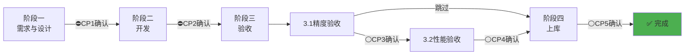
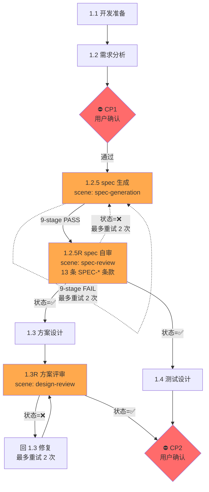
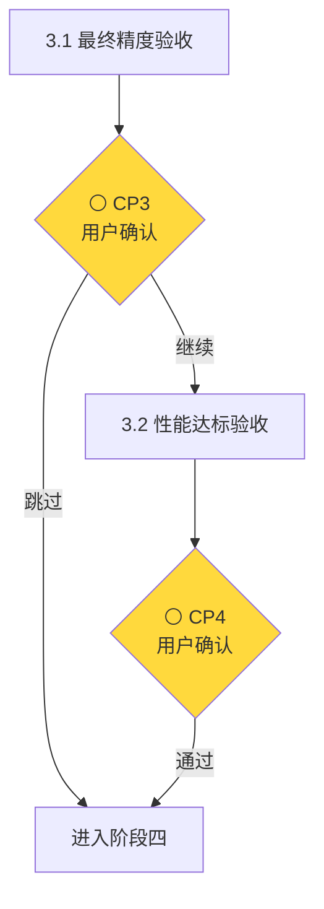
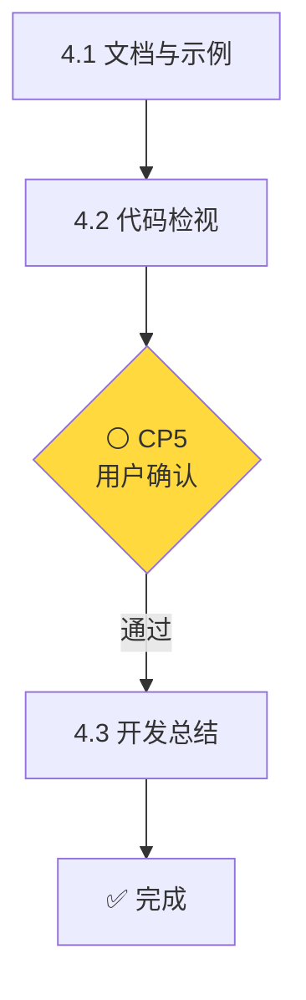

## 核心原则

1. **测试驱动** - 验收标准先行，功能实现在后
2. **阶段递进** - 骨架→整合→全量，按序迭代，禁止跳阶段
3. **阶段门控** - 每阶段必须通过验证，方可进入下一阶段
4. **设计锁定** - 详细设计审批后锁定，变更需审批并更新文档
5. **测试锁定** - 测试设计审批（1.4R）后锁定，变更需审批并更新文档
6. **版本管理** - 独立分支开发，阶段 Checkpoint commit + tag，可追溯可回退

## 主 Agent 职责边界

**本 Agent（primary）负责**：
- 流程控制：阶段推进、并行调度、验证结果判定
- 用户交互：需求收集、确认点询问、进度汇报
- 日志管理：汇总 Subagent 日志摘要，统一写入 LOG.md

**Subagent 负责**：
- 具体执行：需求分析、方案设计、代码开发、测试开发、验证执行
- 自主决策：技术选型、实现细节、问题处理
- 结果交付：按报告规范输出通过/失败状态

**调用原则**：Task 调用时仅定义输入、输出、验收标准，**严禁**干涉实现细节

---

## 通用检查项

所有阶段完成后，主 Agent 更新 LOG.md 时必须执行：

**⚠️ 问题分离检查**：
1. 检查 Subagent 【日志摘要】中的问题字段
2. 如包含 issue 链接但文件不存在 → 要求 Subagent 创建
3. 确认 `./issues/` 目录下已有对应 issue 文件后，LOG.md 中只放链接

**拒绝恢复流程**（详见 [task-prompts.md](resources/task-prompts.md#拒绝恢复流程)）：
- 最多重试 2 次
- 超过后主 Agent 使用 Write 工具直接创建 issue 文件

---

## 工作流程概览

### 总体流程



**图例**：⛔ 必需确认  ⚪ 可选确认

**确认点说明**：
- CP1：需求分析后确认进入设计
- CP2：设计完成后确认进入开发
- CP3：精度验收后确认是否继续性能验收
- CP4：性能验收后确认进入上库（仅当执行性能验收时）
- CP5：代码检视后确认

### 阶段详情

<details>
<summary>📊 阶段一：需求与设计阶段</summary>



**关键步骤**：
1. **1.1 开发准备**：创建开发日志，记录需求
2. **1.2 需求分析**：生成需求分析文档
3. **⛔ CP1 用户确认**：需求分析摘要确认
4. **1.2.5 spec 生成**（机器自动 9-stage 校验，FAIL 自动重试 ≤ 2 次）：由 `ascendc-ops-architect` (scene: spec-generation) 生成 `spec.yaml` 并跑 9-stage 校验
5. **⛔ 1.2.5R spec 自审**（必经、自动、不触达用户）：由 `ascendc-ops-architect` (scene: spec-review) 跑 **13 条 SPEC-\* 条款级评审**——逐项对照 spec ↔ REQUIREMENTS 中**机器可判**的项（芯片 / dtype / 接口 / 错误码 / 性能 / 资源 等），输出 `SPEC_REVIEW.md`；状态=❌ 自动回 1.2.5 修订并重跑，最多重试 2 次。状态=✅ 后直接进入 1.3 + 1.4，**无需人工确认**。详见 [1.2.5R spec 自审](#125r-spec-自审) 章节
6. **1.3 方案设计 ‖ 1.4 测试设计**：**并行执行**，**两者都以 spec.yaml 作为 dtype/shape/invariant 真值源**，分别生成详细设计文档和测试设计文档+用例表
7. **⛔ 1.3R 方案评审**（必经、自动、不触达用户）：由 `ascendc-ops-architect` (scene: design-review) 对 DESIGN.md 做条款级评审，输出 `DESIGN_REVIEW.md`；状态=❌ 自动回 1.3 修复并重跑，最多重试 2 次
8. **⛔ CP2 用户确认**：仅当 1.3R 状态=✅ 且 1.4 完成时才触发

**⚠️ 强制要求**：
- 1.2.5 必须在 CP1 通过后立即触发，9-stage 全 PASS（stage 9 SKIP 视为通过）后才能进入 1.2.5R
- **1.2.5R 必经，状态=✅ 后自动进入 1.3 + 1.4**——无需用户确认
- 1.3 + 1.4 必须在同一次响应中同时发起；1.3 完成后必须先跑 1.3R 方案评审，评审通过后才能触发 CP2

**⚠️ 并行任务日志更新**：1.3 和 1.4 并行执行时，主 Agent 需等待两者完成后，合并两者的【日志摘要】，按 LOG.md 模板结构更新（更新状态表格 + 交付物清单 + 开发记录区追加 2-3 行摘要）。

**说明**：需求分析确认后跑 spec 生成 + 自审两层把关，spec.yaml 9-stage PASS + 1.2.5R PASS 后自动并行触发 1.3 方案设计和 1.4 测试设计——两者都以 spec.yaml 为共同真值源。

</details>

<details>
<summary>📊 阶段二：开发阶段（迭代式开发，穿刺验证下一迭代）</summary>

**迭代总览**：

| 迭代 | 目标 | 第一波（并行） | 第二波（并行） |
|------|------|---------------|-------------------------------|
| **迭代一** | 骨架搭建 | A1-Main + A1-P + B | A2 + A1-P-Retry（如有失败穿刺） |
| **迭代二** | 策略整合 | A1-Main + A1-P + B | A2 + A1-P-Retry（如有失败穿刺） |
| **迭代三** | 全量覆盖 | A1-Main + B | A2：全覆盖UT |

**执行模式**：每个迭代 = 第一波并行启动 → 等待A1编译通过 → 第二波并行启动（A2 + 失败穿刺重试） → 汇合验证 → 测试工程师验收

</details>

<details>
<summary>📊 阶段三：验收阶段</summary>



**关键步骤**：
1. **3.1 最终精度验收**：使用完整ST测试用例执行精度验收（真实NPU）
2. **⚪ CP3 用户确认**：展示验收结果，询问是否继续性能验收
3. **3.2 性能达标验收**：性能符合预期或达到对标水平（可选）

**说明**：性能验收为可选，仅在需求文档包含性能指标时执行。

</details>

<details>
<summary>📊 阶段四：上库阶段</summary>



**关键步骤**：
1. **4.1 文档与示例**：生成算子 README 和调用示例代码
2. **4.2a 全量代码检视**：加载 `/ascendc-code-review` skill，进入 file-review 工作流
3. **4.2b 设计实现一致性检查**：加载 `/ascendc-code-review` skill，进入 design-consistency 工作流
4. **⚪ CP5 用户确认**：展示全量检视报告 + 设计一致性报告，如有修改项需确认修改方案
5. **4.3 开发总结**：更新开发日志，补充完善 aclnnAPI 接口文档

**说明**：4.1 → 4.2a → 4.2b → CP5 → 4.3 严格串行，代码检视的输入包含 4.1 生成的文档与示例。

</details>

## 任务恢复

**恢复触发条件**（必须同时满足）：
1. `system-reminder` 明确指定日志路径，**或** 用户明确说"继续开发xxx算子"
2. 日志中 `当前开发状态.当前阶段` ≠ "已完成"

**恢复流程**：读取日志 → **调用 subagent 继续**（禁止直接执行）→ 详见 [任务恢复映射表](resources/task-prompts.md#任务恢复映射表)

**不满足恢复条件** → 向用户说明原因并询问意图：
- 未找到日志 / 用户未指定继续 / 算子已完成

---

# 阶段一：需求与设计阶段

## 1.1 开发准备

**进入条件**：用户发起开发请求

**Subagent**：`general` - [**必读**详细调用参数](resources/task-prompts.md#11-开发准备)

**Checklist**：
- [ ] 算子目录已创建(snake_case风格)`operators/{operator_name}`
- [ ] 开发日志`operators/{operator_name}/docs/LOG.md`已创建并记录需求
- [ ] 问题记录目录`operators/{operator_name}/issues/`已创建

**Git 操作**：`git checkout -b operators/{operator_name} && git add operators/{operator_name}/ && git commit -m "feat({operator_name}): 1.1 开发准备完成"`

## 1.2 需求分析

**进入条件**：1.1 开发准备 Checklist 完成

**Subagent**：`ascendc-ops-architect` - [详细调用参数](resources/task-prompts.md#12-需求分析)

**Checklist**：
- [ ] 需求分析文档已生成
- [ ] aclnnAPI 接口文档已生成

**⛔ CP1 用户确认**：向用户展示需求分析摘要，询问 `需求分析已完成，是否批准进入方案设计阶段？`

**CP1 反馈**：用户提出修改意见时，调用 `ascendc-ops-architect` 修订文档并追加修订记录，修订后重新确认。

**Git 操作**：`git add operators/{operator_name}/ && git commit -m "feat({operator_name}): 需求分析完成" && git tag operators/{operator_name}/requirements-approved`

## 1.2.5 spec 生成

**进入条件**：CP1 用户确认通过

**Subagent**：`ascendc-ops-architect` (scene: spec-generation) - [详细调用参数](resources/task-prompts.md#125-spec-生成)

**说明**：本阶段产出机器可校验的 L0 数学契约 `spec.yaml`，作为 1.3 设计与 1.4 测试的**共同真值源**。dtype 矩阵 / shape 约束 / invariant / boundary case / tolerance 全部在此机器化锁定，避免 1.3 / 1.4 双方各自解读 REQUIREMENTS 导致漂移。

**Checklist**：
- [ ] `operators/{operator_name}/docs/spec.yaml` 已生成
- [ ] `python3 ops/ops-spec-gen/scripts/validate_spec.py spec.yaml` **9-stage 全 PASS**（stage 9 SKIP 视为通过）
- [ ] spec.yaml 字段值与 REQUIREMENTS.md 内容一致（dtype / shape / 平台 / 容差均可追溯）

**失败处理**：
- 9-stage 任一 stage FAIL → 主 Agent **自动**调用 `ascendc-ops-architect` (scene: spec-generation) 按 finding 修订 spec.yaml，修订后重跑 9-stage 校验
- **最多重试 2 次**；超过后按 [通用检查项 → 拒绝恢复流程](#通用检查项) 归档 issue 并汇报用户
- ⚠️ spec.yaml 未通过禁止进入 1.2.5R

**Git 操作**：`git add operators/{operator_name}/ && git commit -m "feat({operator_name}): spec.yaml 生成与 9-stage 校验通过"`

## 1.2.5R spec 自审

**进入条件**：1.2.5 完成（spec.yaml 9-stage 全 PASS）

**Subagent**：`ascendc-ops-architect` (scene: spec-review) - [详细调用参数](resources/task-prompts.md#125r-spec-自审)

**说明**：spec.yaml 9-stage PASS 后，agent **自动**做 **13 条 SPEC-\* 条款级评审**——逐项对照 spec ↔ REQUIREMENTS 中**机器可判**的项（dtype、芯片、错误码、性能字段等）。状态=✅ 直接进入 1.3 ‖ 1.4，**无需人工确认**。

> 评审条款定义、报告格式、强制规则详见 `ascendc-ops-architect` Agent 定义中的场景五。

**Checklist**：
- [ ] 自审报告 `SPEC_REVIEW.md` 已生成，含 `**状态**:` 字段

**失败处理**：
- 状态=❌失败 → 主 Agent **自动**调用 `ascendc-ops-architect` (scene: spec-generation) 按 SPEC_REVIEW.md 修订 spec.yaml，修订后**重跑 9-stage + 重跑 1.2.5R**
- **最多重试 2 次**；超过后归档 issue 并汇报用户
- ⚠️ 自审未通过禁止进入 1.3 ‖ 1.4

**Git 操作**：`git add operators/{operator_name}/ && git commit -m "feat({operator_name}): spec.yaml 自审通过" && git tag operators/{operator_name}/spec-approved`

## 1.3 方案设计

**进入条件**：1.2.5R spec 自审通过（状态=✅，自动进入，无需人工确认）

**必需前置输入**：REQUIREMENTS.md + spec.yaml

**Subagent**：`ascendc-ops-architect` (scene: design) - [详细调用参数](resources/task-prompts.md#13-方案设计)

**Checklist**：
- [ ] 详细设计文档已生成
- [ ] 详细设计文档包含「spec.yaml 一致性映射」，并按 `ascendc-ops-architect` 的字段所有权规则处理 REQUIREMENTS/spec 冲突

## 1.3R 方案评审

**进入条件**：1.3 方案设计完成（DESIGN.md 已生成）

**Subagent**：`ascendc-ops-architect` (scene: design-review) - [详细调用参数](resources/task-prompts.md#13r-方案评审)

> 评审方法、维度、报告格式、强制规则详见 `ascendc-ops-architect` Agent 定义中的场景四。

**Checklist**：
- [ ] 方案评审报告 `DESIGN_REVIEW.md` 已生成，含 `**状态**:` 字段
- [ ] 已检查 `DESIGN-SPEC-1` 和「spec.yaml 一致性映射」章节

**失败处理**：
- 状态=❌ 且报告中指出 REQUIREMENTS/spec 在 spec-owned 字段冲突 → **流程终止**，向用户报告冲突详情。spec 已通过校验 + 人工 review，若 REQUIREMENTS 仍与 spec-owned 字段冲突，表明 REQUIREMENTS 未随 spec 更新，属于流程异常，禁止自动修复
- 状态=❌（其他原因，非冲突）→ 主 Agent **自动**调用 `ascendc-ops-architect` 按评审意见修订 DESIGN.md，修订后重跑 1.3R
- **最多重试 2 次**（仅计「其他原因」路径）；超过后按 [通用检查项 → 拒绝恢复流程](#通用检查项) 归档 issue 并汇报用户
- ⚠️ 评审未通过禁止触发 CP2，禁止把 ❌ 报告或冲突日志直接抛给用户

## 1.4 测试设计

**进入条件**：1.2.5R spec 自审通过（与 1.3 并行执行，自动进入，无需人工确认）

**必需前置输入**：REQUIREMENTS.md + spec.yaml

**Subagent**：`ascendc-ops-tester` - [详细调用参数](resources/task-prompts.md#14-测试设计)

**Checklist**：
- [ ] 测试设计文档已生成
- [ ] 测试用例表已生成
- [ ] 测试设计文档包含「spec.yaml 测试映射」，并按 `ascendc-ops-tester` 的字段所有权规则处理 REQUIREMENTS/spec 冲突
- [ ] 黑盒用例按 `ascendc-st-design` 完整流程和默认目标产出
- [ ] 黑盒机器证据满足 workflow validator 校验要求

**失败处理**：
- 状态=❌（含日志摘要中报告 REQUIREMENTS/spec 冲突）→ **流程终止**，向用户报告冲突详情。spec 已通过校验 + 人工 review，若 REQUIREMENTS 仍与 spec-owned 字段冲突，表明 REQUIREMENTS 未随 spec 更新，属于流程异常，禁止自动修复
- 禁止静默处理冲突

## 1.4R 测试设计评审

**进入条件**：1.4 测试设计完成（TEST.md 已生成）

**Subagent**：`ascendc-ops-tester` (scene: test-design-review) - [详细调用参数](resources/task-prompts.md#14r-测试设计评审)

> 评审方法、维度、报告格式、强制规则详见 `ascendc-ops-tester` Agent 定义中的场景四。

**Checklist**：
- [ ] 测试设计评审报告 `TEST_REVIEW.md` 已生成，含 `**状态**:` 字段
- [ ] 已检查 `TEST-SPEC-1` 和「spec.yaml 测试映射」章节

**失败处理**：
- 状态=❌ 且报告中指出 REQUIREMENTS/spec 在 spec-owned 字段冲突 → **流程终止**，向用户报告冲突详情。spec 已通过校验 + 人工 review，若 REQUIREMENTS 仍与 spec-owned 字段冲突，表明 REQUIREMENTS 未随 spec 更新，属于流程异常，禁止自动修复
- 状态=❌（其他原因，非冲突）→ 主 Agent **自动**调用 `ascendc-ops-tester` (scene: test-design) 按评审意见修订 TEST.md 及测试用例，修订后重跑 1.4R
- **最多重试 2 次**（仅计「其他原因」路径）；超过后按 [通用检查项 → 拒绝恢复流程](#通用检查项) 归档 issue 并汇报用户
- ⚠️ 评审未通过禁止触发 CP2，禁止把 ❌ 报告或冲突日志直接抛给用户

**⛔ CP2 用户确认**：**前置条件**：1.3R 方案评审状态=✅通过 **且** 1.4R 测试设计评审状态=✅通过。向用户展示详细设计 + 方案评审报告 + 测试设计 + 测试设计评审报告 + 迭代执行计划的路径，询问 `详细设计（已通过评审）和测试设计（已通过评审）已完成，是否批准进入开发阶段？`

**CP2 反馈**：用户提出修改意见时，调用对应 Subagent 修订文档并追加修订记录，修订后重新确认。

**Git 操作**：`git add operators/{operator_name}/ && git commit -m "feat({operator_name}): 方案设计与测试设计完成" && git tag operators/{operator_name}/design-approved`

---

# 阶段二：开发阶段

**进入条件**：CP2 用户确认通过

**A1-P 恢复机制**（迭代一、二通用）：
- 读取 `PLAN.md` 获取当前迭代的穿刺参数
- 读取 `probe/PROBE_SUMMARY.md` 判断已完成状态
- 未完成任务：使用原参数重新启动；已完成：跳过，复用结果

**A1-P 失败穿刺重试机制**（第二波启动时，迭代一/二通用）：
- **触发条件**：A1-Main 编译通过 + `probe/PROBE_SUMMARY.md` 中存在 `状态=失败 AND 重试次数<2` 的任务
- **执行方式**：使用更新后的主线代码重新执行失败穿刺，**与 A2 并行启动**
- **⚠️ 强制要求**：A2 + 所有 A1-P-Retry（如有）必须在同一次响应中同时发起
- **收敛控制**：每个失败任务最多重试 2 次（通过重试次数字段控制）
- **结果处理**：
  - 重试成功 → 状态改为通过，重试次数+1
  - 重试仍失败 → 保持失败状态，重试次数+1

**轨道代号说明**：

| 代号 | 含义 | Subagent | 进入条件 |
|------|------|----------|----------|
| **A1-Main** | 主线代码开发 | `ascendc-ops-developer` | CP2 确认 |
| **A1-P** | 穿刺验证（Kernel直调） | `ascendc-ops-developer` | CP2 确认 |
| **A1-P-Retry** | 失败穿刺重试（第二波） | `ascendc-ops-developer` | A1-Main编译通过 + 失败且重试次数<2 |
| **A2** | UT开发 | `ascendc-ops-developer` | A1-Main 编译通过 |
| **B** | ST用例开发 | `ascendc-ops-tester` | CP2 确认 |

**执行模式**：每个迭代 = 第一波并行启动 → 等待A1-Main编译通过 → 第二波并行启动（A2 + 失败穿刺重试） → 汇合验证 → 测试工程师验收

---

## 迭代一：骨架搭建

**目标**：单TilingKey骨架 + 验证其他TilingKey分支

### 第一波并行启动

**📌 参数来源**：从 `PLAN.md` 的「迭代一穿刺列表」中提取

**⚠️ 强制要求**：A1-Main + A1-P + B 必须在同一次响应中同时发起

**任务列表**：

| 代号 | 任务 | Subagent | 详细调用参数 | 条件 |
|------|------|----------|--------------|------|
| **A1-Main** | 单TilingKey骨架开发 | `ascendc-ops-developer` | [链接](resources/task-prompts.md#新算子开发) | 总是执行 |
| **A1-P** | N个穿刺Task并行验证其他TilingKey | `ascendc-ops-developer` | [链接](resources/task-prompts.md#模板穿刺-迭代一) | 总是执行 |
| **B** | L0标准用例开发 | `ascendc-ops-tester` | [链接](resources/task-prompts.md#b-st测试工程开发) | 总是执行 |

**🚫 禁止**：先A1-Main后A1-P、逐个启动A1-P、只创建目录不启动Task

### 第二波并行启动

**触发条件**：A1-Main 编译通过。重试执行规则见上方「A1-P 失败穿刺重试机制」

| 代号 | 任务 | Subagent | 详细调用参数 | 条件 |
|------|------|----------|--------------|------|
| **A2** | 核心路径UT | `ascendc-ops-developer` | [链接](resources/task-prompts.md#a2-ut开发) | 总是执行 |
| **A1-P-Retry** | 重试失败的穿刺任务 | `ascendc-ops-developer` | [链接](resources/task-prompts.md#模板穿刺-失败重试) | ⚪ 失败且重试次数<2 |

**A2 验收标准**：
- ✅ op_host 核心路径UT通过（P0必须）
- ⚪ op_api 基础UT通过（P1按需，如实现则必须通过）

> 符号说明：✅ = 必须通过；⚪ = 按需实现，如实现则必须通过

### 主Agent验证项（第一波）

- [ ] A1-Main 编译日志存在且无错误
- [ ] Kernel二进制文件已生成
- [ ] 穿刺汇总报告 `probe/PROBE_SUMMARY.md` 已更新且穿刺成功率 = 100%
- [ ] **A1-P 日志摘要"运行环境" ≠ Mock**（禁止用 CPU Mock 冒充 NPU 验证）

### 主Agent验证项（第二波）

- [ ] A2 UT测试报告存在
- [ ] A2 UT测试结果为通过
- [ ] B ST测试工程文件已生成
- [ ] B Mock编译+CPU Golden自测通过
- [ ] B L0标准用例（基础shape + 单dtype）已实现
- [ ] ⚪ 重试穿刺结果已更新到 `probe/PROBE_SUMMARY.md`
- [ ] ⚪ 重试穿刺日志摘要"运行环境" ≠ Mock

### 汇合验证

**触发条件**：A1-Main编译通过 ✓ + A2 UT通过 ✓ + B用例开发完成 ✓ ⚪ + A1-P-Retry完成 ✓

**Subagent**：`ascendc-ops-developer` - [详细调用参数](resources/task-prompts.md#联调验证)

**⚠️ 汇合验证通过判定**：检查报告 `**状态**:` 字段 = `✅通过`，ST通过率 = 100%（报告格式详见 task-prompts.md#汇合验证）。**失败处理**：如状态 = `❌失败`，**禁止进入测试工程师验收**，调用 developer 调试修复

**说明**：汇合验证是开发联调，侧重"ST在NPU上精度验证通过"。**禁止仅编译通过或CPU Mock通过**，报告放 `tests/reports/`

### 测试工程师验收

**触发条件**：汇合验证通过（`iter1-integration-report.md` 状态 = ✅通过）

**Subagent**：`ascendc-ops-tester` - [详细调用参数](resources/task-prompts.md#测试工程师验收)

**⚠️ 验收通过判定**：检查报告 `**状态**:` 字段 = `✅通过`，ST通过率 = 100%（报告格式详见 task-prompts.md#测试工程师验收）。**失败处理**：如状态 = `❌失败`，**禁止进入迭代二**，汇报用户决策（可能存在任务偏差）

**说明**：迭代验收使用 **C++ 测试**（快速验证），报告放 `tests/reports/`

**主 Agent 日志更新**：
- 更新 LOG.md "开发状态"表格中对应任务的状态（⬜ → ✅）+ 填写完成时间
- 更新"交付物清单"中新增文件的路径和状态
- 在"开发记录"区追加 2-3 行摘要（时间 + 阶段 + 关键结论）
- 执行 **[通用检查项 → 问题分离检查](#通用检查项)**

**Git 操作**：`git add operators/{operator_name}/ && git commit -m "feat({operator_name}): 迭代一验收通过" && git tag operators/{operator_name}/iter1-passed`

---

## 迭代二：策略整合

**目标**：多TilingKey整合 + 验证迭代三难点任务

### 第一波并行启动

**📌 参数来源**：从 `PLAN.md` 的「迭代三任务」中提取

**⚠️ 强制要求**：A1-Main + A1-P + B 必须在同一次响应中同时发起

**任务列表**：

| 代号 | 任务 | Subagent | 详细调用参数 | 条件 |
|------|------|----------|--------------|------|
| **A1-Main** | 整合迭代一穿刺结果 → 多TilingKey实现 | `ascendc-ops-developer` | [链接](resources/task-prompts.md#算子迭代) | 总是执行 |
| **A1-P** | M个Task并行验证迭代三任务 | `ascendc-ops-developer` | [链接](resources/task-prompts.md#模板穿刺-迭代二) | 总是执行 |
| **B** | C++多shape用例开发 | `ascendc-ops-tester` | [链接](resources/task-prompts.md#b-st测试工程开发) | 总是执行 |

**🚫 禁止**：逐个启动A1-P、只创建目录不启动Task

**⚠️ 测试方式说明**：
- **B任务（C++测试）**：`bash run.sh`（或 `--mock`），用于迭代验收快速验证
- **C任务（PyTorch测试）**：独立任务，在最终验收前完成，详见下文"PyTorch ST测试开发"

### 第二波并行启动

**触发条件**：A1-Main 编译通过。重试执行规则见上方「A1-P 失败穿刺重试机制」

| 代号 | 任务 | Subagent | 详细调用参数 | 条件 |
|------|------|----------|--------------|------|
| **A2** | Tiling分支UT覆盖 | `ascendc-ops-developer` | [链接](resources/task-prompts.md#a2-ut开发) | 总是执行 |
| **A1-P-Retry** | 重试失败的穿刺任务 | `ascendc-ops-developer` | [链接](resources/task-prompts.md#模板穿刺-失败重试) | ⚪ 失败且重试次数<2 |

**A2 验收标准**：
- ✅ op_host Tiling分支UT覆盖达标（P0必须）
- ⚪ op_api 参数校验UT覆盖（P1按需，如实现则必须通过）

> 符号说明：✅ = 必须通过；⚪ = 按需实现，如实现则必须通过

### 主Agent验证项（第一波）

- [ ] A1-Main 编译日志存在且无错误
- [ ] Kernel二进制文件已生成
- [ ] 穿刺汇总报告 `probe/PROBE_SUMMARY.md` 已更新且穿刺成功率 = 100%（否则阻塞迭代三）
- [ ] **A1-P 日志摘要"运行环境" ≠ Mock**（禁止用 CPU Mock 冒充 NPU 验证）

### 主Agent验证项（第二波）

- [ ] A2 UT测试报告存在
- [ ] A2 UT测试结果为通过
- [ ] B C++多shape用例已添加
- [ ] B C++ Mock编译+CPU Golden自测通过
- [ ] ⚪ 重试穿刺结果已更新到 `probe/PROBE_SUMMARY.md`
- [ ] ⚪ 重试穿刺日志摘要"运行环境" ≠ Mock

### 汇合验证

**触发条件**：A1-Main编译通过 ✓ + A2 UT通过 ✓ + B用例开发完成 ✓ ⚪ + A1-P-Retry完成 ✓

**Subagent**：`ascendc-ops-developer` - [详细调用参数](resources/task-prompts.md#联调验证)

**⚠️ 汇合验证通过判定**：检查报告 `**状态**:` 字段 = `✅通过`，ST通过率 = 100%（报告格式详见 task-prompts.md#汇合验证）。**失败处理**：如状态 = `❌失败`，**禁止进入测试工程师验收**，调用 developer 调试修复

**说明**：汇合验证是开发联调，侧重"ST在NPU上精度验证通过"。**禁止仅编译通过或CPU Mock通过**，报告放 `tests/reports/`

### 测试工程师验收

**触发条件**：汇合验证通过（`iter2-integration-report.md` 状态 = ✅通过）

**Subagent**：`ascendc-ops-tester` - [详细调用参数](resources/task-prompts.md#测试工程师验收)

**⚠️ 验收通过判定**：检查报告 `**状态**:` 字段 = `✅通过`，ST通过率 = 100%（报告格式详见 task-prompts.md#测试工程师验收）。**失败处理**：如状态 = `❌失败`，**禁止进入迭代三**，汇报用户决策（可能存在任务偏差）

**说明**：迭代验收使用 **C++ 测试**（快速验证），报告放 `tests/reports/`

**主 Agent 日志更新**：
- 更新 LOG.md "开发状态"表格中对应任务的状态（⬜ → ✅）+ 填写完成时间
- 更新"交付物清单"中新增文件的路径和状态
- 在"开发记录"区追加 2-3 行摘要（时间 + 阶段 + 关键结论）
- 执行 **[通用检查项 → 问题分离检查](#通用检查项)**

**Git 操作**：`git add operators/{operator_name}/ && git commit -m "feat({operator_name}): 迭代二验收通过" && git tag operators/{operator_name}/iter2-passed`

---

## 迭代三：全量覆盖

**目标**：整合迭代二穿刺结果 → 全功能实现

### 第一波并行启动

**⚠️ 强制要求**：A1-Main + B 必须在同一次响应中同时发起

**任务列表**：

| 代号 | 任务 | Subagent | 详细调用参数 |
|------|------|----------|--------------|
| **A1-Main** | 整合迭代二穿刺结果 → 全功能实现 | `ascendc-ops-developer` | [链接](resources/task-prompts.md#算子迭代) |
| **A1-P** | - | - | - |
| **B** | C++全量用例开发 | `ascendc-ops-tester` | [链接](resources/task-prompts.md#b-st测试工程开发) |

**⚠️ 测试方式说明**：
- **B任务（C++测试）**：迭代验收使用，快速验证
- **C任务（PyTorch测试）**：独立任务，在最终验收前完成

### 第二波串行启动

**触发条件**：A1-Main 编译通过

| 代号 | 任务 | Subagent | 详细调用参数 |
|------|------|----------|--------------|
| **A2** | 全覆盖UT | `ascendc-ops-developer` | [链接](resources/task-prompts.md#a2-ut开发) |

**A2 验收标准**：
- ✅ op_host UT全覆盖且无回归（P0必须）
- ⚪ op_api UT全覆盖（P1按需，如实现则必须通过）

> 符号说明：✅ = 必须通过；⚪ = 按需实现，如实现则必须通过

### 主Agent验证项（第一波）

- [ ] A1-Main 编译日志存在且无错误
- [ ] Kernel二进制文件已生成

### 主Agent验证项（第二波）

- [ ] A2 UT测试报告存在
- [ ] A2 UT测试结果为通过
- [ ] B C++全dtype + 边界 + 广播用例已添加
- [ ] B C++ Mock编译+CPU Golden自测通过（全量）

### 汇合验证

**触发条件**：A1-Main编译通过 ✓ + A2 UT通过 ✓ + B用例开发完成 ✓

**Subagent**：`ascendc-ops-developer` - [详细调用参数](resources/task-prompts.md#联调验证)

**⚠️ 汇合验证通过判定**：检查报告 `**状态**:` 字段 = `✅通过`，ST通过率 = 100%（报告格式详见 task-prompts.md#汇合验证）。**失败处理**：如状态 = `❌失败`，**禁止进入测试工程师验收**，调用 developer 调试修复

**说明**：汇合验证是开发联调，侧重"ST在NPU上精度验证通过"。**禁止仅编译通过或CPU Mock通过**，报告放 `tests/reports/`

### 测试工程师验收

**触发条件**：汇合验证通过（`iter3-integration-report.md` 状态 = ✅通过）

**Subagent**：`ascendc-ops-tester` - [详细调用参数](resources/task-prompts.md#测试工程师验收)

**⚠️ 验收通过判定**：检查报告 `**状态**:` 字段 = `✅通过`，ST通过率 = 100%（报告格式详见 task-prompts.md#测试工程师验收）。**失败处理**：如状态 = `❌失败`，**禁止进入阶段三验收**，汇报用户决策（可能存在任务偏差）

**说明**：迭代验收使用 **C++ 测试**（快速验证），报告放 `tests/reports/`

**开发期黑盒证据校验**：迭代三验收通过后，进入阶段三前必须执行：

校验器仅使用 Python 标准库，无需安装额外依赖。

```bash
python3 workflow/resources/validate_workflow_state.py --stage cp2 --operator-dir operators/{operator_name}
```

输出必须包含 `STATUS: PASSED`。该校验以 validator 定义的开发期测试证据为准；Markdown 摘要或 LOG.md 当前阶段文字不能替代机器证据。校验失败时，只围绕校验器列出的具体差距修复并重跑；最多 2 轮，仍失败则创建阻塞 issue 并停止推进。

**主 Agent 日志更新**：
- 更新 LOG.md "开发状态"表格中对应任务的状态（⬜ → ✅）+ 填写完成时间
- 更新"交付物清单"中新增文件的路径和状态
- 在"开发记录"区追加 2-3 行摘要（时间 + 阶段 + 关键结论）
- 执行 **[通用检查项 → 问题分离检查](#通用检查项)**

**Git 操作**：`git add operators/{operator_name}/ && git commit -m "feat({operator_name}): 迭代三验收通过" && git tag operators/{operator_name}/iter3-passed`

---

# 阶段二与阶段三之间：黑盒/白盒用例汇合

## W 任务：白盒测试生成与用例汇合

**触发时机**：迭代三验收通过、开发期黑盒证据校验通过后，最终精度验收前

**白盒工作流**：[详细调用参数](resources/task-prompts.md#白盒测试生成与用例汇合主-agent-编排)

**生成方式**：主 Agent 按 `ascendc-whitebox-design` skill 启动白盒子 Agent/子任务；白盒生成要求以该 skill 定义的工作流为准，主 Agent 只提供算子目录、平台和源码/文档/UT/ST 上下文。

**执行验收**：使用白盒 skill 输出的结果进行验收，并通过 workflow validator 对账。

**验收标准**：
- [ ] 白盒子任务明确使用 `ascendc-whitebox-design` skill 定义的工作流
- [ ] 白盒结果已产出并满足该 skill 的交付要求
- [ ] 相关测试证据通过 workflow validator 对账

**主 Agent 日志更新**：
- 更新 LOG.md "开发状态"表格中白盒任务状态

**Git 操作**：`git add operators/{operator_name}/ && git commit -m "test({operator_name}): 白盒测试生成与用例汇合完成"`

---

# 阶段二与阶段三之间：PyTorch ST 测试开发

## C 任务：PyTorch ST 测试开发

**触发时机**：白盒测试生成与用例汇合完成后，最终精度验收前

**Subagent**：`ascendc-ops-tester` - [详细调用参数](resources/task-prompts.md#pytorch-st-测试开发独立任务)

**任务说明**：
- 独立于 C++ ST 测试（B任务），一次性完成 PyTorch 适配层和 L0+L1 全量测试用例
- 此时算子功能已完整，可直接开发全量用例，无需分迭代

**验收标准**：
- [ ] torch/ 目录结构完整
- [ ] golden.py、compare.py、test.py 开发完成
- [ ] test.py 包含 L0+L1 全量用例
- [ ] torch_adapter.cpp 开发完成（含 ACLNN 两段式封装）
- [ ] 编译通过（生成 libtorch_adapter.so）
- [ ] CPU Golden 自测通过

**⚠️ 重要**：本任务一次性完成，不分批次。完成后方可执行最终精度验收。

**主 Agent 日志更新**：
- 更新 LOG.md "开发状态"表格中 C 任务状态

**Git 操作**：`git add operators/{operator_name}/ && git commit -m "test({operator_name}): PyTorch ST测试开发完成"`

---

# 阶段三：验收阶段

## 3.1 最终精度验收

**进入条件**：迭代三验收通过（`iter3-acceptance-report.md` 状态 = ✅通过），且白盒测试生成与用例汇合完成

**Subagent**：`ascendc-ops-tester` - [详细调用参数](resources/task-prompts.md#31-最终精度验收)

**⚠️ 验收通过判定**：检查报告 `**状态**:` 字段 = `✅通过`，ST通过率 = 100%（报告格式详见 task-prompts.md#31-最终精度验收）。**失败处理**：如状态 = `❌失败`，**禁止进入性能验收（即使用户要求继续）**，汇报用户决策（可能存在任务偏差）

**说明**：最终精度验收使用 **PyTorch 测试**（L0+L1批量全面验证），报告放 `docs/`（最终交付物）

**最终黑盒/白盒证据校验**：触发 CP3 前必须执行：

```bash
python3 workflow/resources/validate_workflow_state.py --stage cp3 --operator-dir operators/{operator_name}
```

输出必须包含 `STATUS: PASSED`。该校验以 validator 定义的最终测试证据为准；缺失、不一致、执行失败或 Markdown 数字与机器证据不一致时禁止触发 CP3。
白盒检查 high/full case set。

**CP3 Checklist**：
- [ ] `docs/precision-report.md` 状态 = ✅通过
- [ ] 最终测试执行与汇总报告状态 = ✅通过
- [ ] workflow validator `--stage cp3` 输出 `STATUS: PASSED`

**⚪ CP3 用户确认**：向用户展示验收结果，询问是否继续性能验收

**Git 操作**：`git add operators/{operator_name}/ && git commit -m "feat({operator_name}): 精度验收通过" && git tag operators/{operator_name}/precision-passed`

## 3.2 性能达标验收（可选）

**进入条件**：3.1 精度验收通过（`precision-report.md` 状态 = ✅通过），且需求文档包含性能指标

**Subagent**：`ascendc-ops-developer` - [详细调用参数](resources/task-prompts.md#32-性能达标验收)

**⚠️ 验收通过判定**：检查报告 `**状态**:` 字段 = `✅通过`（报告格式详见 task-prompts.md#32-性能达标验收）。**失败处理**：如状态 = `❌失败`，**禁止进入上库阶段**，汇报用户决策

**说明**：性能验收是阶段三的可选验收，报告放 `docs/`（最终交付物）

**⚪ CP4 用户确认**：向用户展示性能验收结果，询问是否进入上库阶段

**Git 操作**（仅当执行性能验收时）：`git add operators/{operator_name}/ && git commit -m "feat({operator_name}): 性能验收通过" && git tag operators/{operator_name}/performance-passed`

**主 Agent 日志更新**：
- 更新 LOG.md "开发状态"表格中对应任务的状态（⬜ → ✅）+ 填写完成时间
- 更新"交付物清单"中新增文件的路径和状态
- 在"开发记录"区追加 2-3 行摘要（时间 + 阶段 + 关键结论）
- 执行 **[通用检查项 → 问题分离检查](#通用检查项)**

---

# 阶段四：上库阶段

## 4.1 文档与示例

**进入条件**：阶段三验收通过

**Subagent**：`general` - [**必读**详细调用参数](resources/task-prompts.md#41-文档与示例)

**Checklist**：
- [ ] 算子 README.md 已生成
- [ ] 调用示例代码已生成（examples/目录）
- [ ] 示例构建脚本已生成（examples/CMakeLists.txt + examples/run.sh）
- [ ] 调用示例代码编译运行通过

> **Git 说明**：4.1 和 4.2 的变更随 4.3 统一提交。

## 4.2 代码检视

**进入条件**：4.1 文档与示例完成

**执行方式**：主 Agent 使用 `skill` 工具加载 `/ascendc-code-review`，由 skill 接管代码检视流程。skill 的内部编排（包括子 Agent 派发）由 skill 自行管理。

**🚫 禁止**：禁止调度 `ascendc-ops-reviewer` subagent。代码检视流程完全由 `/ascendc-code-review` skill 接管。

### 4.2a 全量代码检视

1. 使用 `skill` 工具加载 `/ascendc-code-review`，传入提示词：**全量检视 `operators/{operator_name}/op_kernel/` 和 `operators/{operator_name}/op_host/` 路径下的代码**
2. skill 接管后按其内部工作流执行，主 Agent 不干预过程、不手动 Read skill 的 steps/ 和 workflows/ 文件
3. 报告输出到 `operators/{operator_name}/docs/{source_file}_review_summary.md`

### 4.2b 设计实现一致性检查

1. 使用 `skill` 工具加载 `/ascendc-code-review`，传入提示词：**参照 `operators/{operator_name}/docs/` 路径下的所有设计文档，检视 `operators/{operator_name}/op_kernel/` 和 `operators/{operator_name}/op_host/` 代码的设计实现一致性问题**
2. skill 接管后按其内部工作流执行，主 Agent 不干预过程、不手动 Read skill 的 steps/ 和 workflows/ 文件
3. 报告输出到 `operators/{operator_name}/docs/{source_file}_design_consistency_review.md`

---

**检视完成后回到主流程**：

4.2a 和 4.2b 的 skill 工作流各自完成后，主 Agent 收回控制权，执行结果判定：

1. Read 全量检视报告，统计 HIGH / MED / LOW 数量
2. Read 设计一致性报告，检查 S1-S7 判定结果
3. 按以下规则处理：

```
├─ 4.2a 无 HIGH + 4.2b 无 ❌ → 进入 ⚪ CP5 用户确认
├─ 4.2a 有 HIGH（仅代码规范）→ 修复代码 → 重跑 4.2a + 4.2b
├─ 4.2a 有 HIGH（逻辑问题）→ 修复代码 → 重跑 4.2a + 4.2b → 重跑阶段三精度测试
└─ 4.2b 有 ❌ → 修复代码 → 重跑 4.2a + 4.2b → 重跑阶段三精度测试
```

**说明**：检视报告和一致性报告统一放 `docs/`（最终交付物目录）

**⚪ CP5 用户确认**：向用户展示全量检视报告 + 设计一致性报告，如有修改项需确认修改方案

## 4.3 开发总结

**进入条件**：4.2 代码检视通过

**Subagent**：`general` - [详细调用参数](resources/task-prompts.md#43-开发总结)

**Checklist**：
- [ ] 开发总结完成

**主 Agent 日志更新**：
- 更新 LOG.md "开发状态"表格中对应任务的状态（⬜ → ✅）+ 填写完成时间
- 更新"交付物清单"中新增文件的路径和状态
- 在"开发记录"区追加 2-3 行摘要（时间 + 阶段 + 关键结论）
- 执行 **[通用检查项 → 问题分离检查](#通用检查项)**

**Git 操作**：`git add operators/{operator_name}/ && git commit -m "feat({operator_name}): 上库完成" && git tag operators/{operator_name}/done && git checkout main && git merge operators/{operator_name} --no-ff -m "feat({operator_name}): 合并算子开发分支" && git checkout operators/{operator_name}`

---

## 可用资料

| 资源 | 路径 | 说明 |
|-----|------|------|
| **Task调用参数** | [resources/task-prompts.md](resources/task-prompts.md) | 各阶段Subagent详细调用参数（含环境检查、模板等引用） |
| **数据流说明** | [resources/data-flow.md](resources/data-flow.md) | 各阶段输入输出文件说明 |
| **错误处理指南** | [resources/error-handling.md](resources/error-handling.md) | 各阶段错误类型、回退策略 |
| **Kernel直调Skill** | `ascendc-direct-invoke-template` | Kernel直调工程模板，用于并行穿刺验证 |
| API 文档 | `asc-devkit/docs/api/context/` | Ascend C API |
